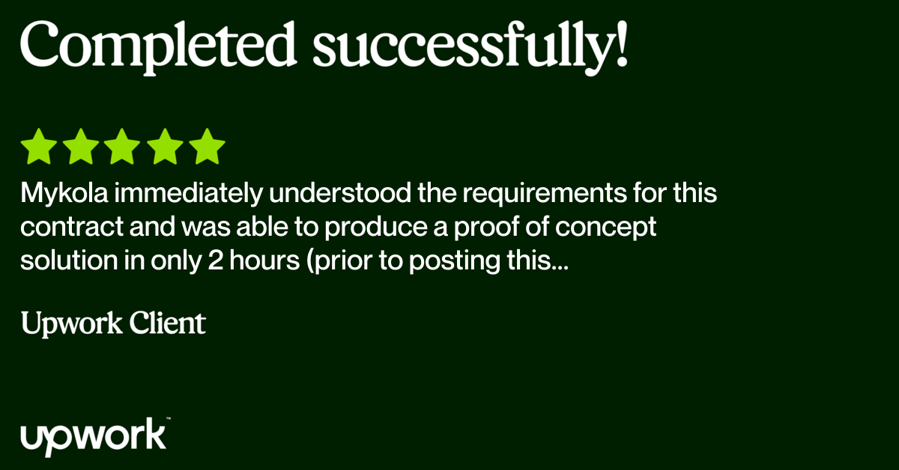

+++
title = "Services"
description = "Mykola Zotko | ML & Data Engineer, Open Source Developer"
+++

## 🤖 AI & Machine Learning

- **ML Model Development & Integration**

  - Custom machine learning models using TensorFlow, PyTorch, and scikit-learn
  - End-to-end ML pipelines and API deployment for production environments

- **Applied AI for Business**

  - Integration of AI into existing tools and workflows
  - Customization and optimization of pre-trained models for specific use cases

- **Computer Vision & NLP**

  - Image classification, object detection, and visual analytics
  - Natural Language Processing (NLP) for text summarization, sentiment
    analysis, and chatbot solutions

- **Intelligent Decision Systems**
  - Recommendation engines and personalization tools
  - Predictive analytics and pattern recognition to support strategic decisions

## 📊 Data Science & Analytics

- **Data Engineering & Pipeline Architecture**

  - Design and implementation of robust ETL workflows
  - Automation of data ingestion and processing for real-time and batch
    pipelines

- **Data Visualization & Business Intelligence**

  - Interactive dashboards using Plotly, Streamlit, or Dash
  - Custom reporting solutions, KPI tracking, and business insights

- **Big Data Processing**

  - High-volume data handling with PySpark and distributed systems
  - Scalable architecture for efficient data transformation and storage

- **Strategic Data Science**
  - Advanced analytics for trend identification and decision support
  - Predictive modeling for operational and customer insights

## ☁️ Cloud & DevOps

- **Cloud Infrastructure & Services**

  - Deployment and scaling on AWS, Google Cloud Platform, and Azure
  - Serverless architectures, flexible container solutions, and scalable storage
    options for cloud-native applications

- **DevOps & Automation**

  - CI/CD pipeline development for automated testing and deployment
  - Infrastructure as Code with Terraform for consistent cloud environments

- **Containerization & Orchestration**

  - Docker-based environments for reliable, portable deployments
  - Kubernetes orchestration for high-availability systems

- **Workflow Orchestration**
  - Pipeline automation for efficiency enhancement and process optimization
  - Scheduling, monitoring, and managing data and infrastructure workflows

## 🐍 Python Development

- **Web Application Development**

  - Building scalable, interactive, and responsive web applications
  - RESTful API development for seamless system integration

- **Backend & Automation Solutions**

  - Secure database integration and user authentication systems
  - Business process automation and custom CLI tools
  - Design of modular, scalable backend architecture

- **System Modernization**
  - Migration of legacy codebases to modern Python versions
  - Refactoring and optimization for improved performance and maintainability

---

<!-- ## What My Clients Say

> Mykola immediately understood the requirements for this contract and was able
> to produce a proof of concept solution in only 2 hours (prior to posting this
> contract, a junior data scientist had spent almost 2 weeks to get the same
> result). His grasp on the short and long term requirements of the larger
> project that this contract is attached to were perfect and he has already
> given us ideas for future enhancements to the application using machine
> learning. Furthermore, his comprehension of statistics and his ability to
> apply modern tools, libraries and programming to completing this initial
> contract is at well above the industry standard. As both a programmer and
> project manager, I can personally state that his code was well written,
> included comments and was trivial to adapt to our existing codebase. We will
> absolutely continue using Mykola's services for all future development on the
> larger application and I can happily recommend him to anyone looking for help
> on any system that requires a talented data scientist. -->
